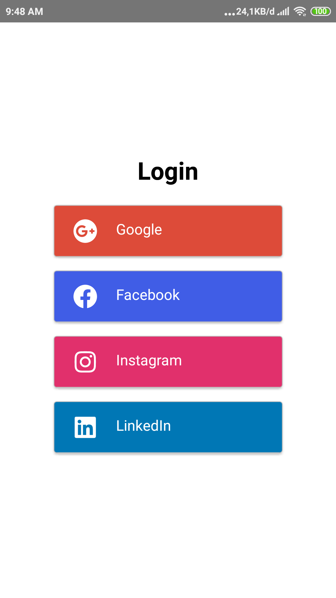

<h1 align="center">Tes Link Media Sehat</h1>

  

  Built with React Native.

## Requirements
* [`npm`](https://www.npmjs.com/get-npm)
* [`react-native`](https://facebook.github.io/react-native/docs/getting-started)
* [`react-native-cli`](https://facebook.github.io/react-native/docs/getting-started)

## Screenshots

    
    
    
    
    

## Release APK

## Contributors

  <table>
    <tr>
      <td align="center">
        <a href="https://github.com/abdillahtop">
           
          <b>Abdillah Dzulfikar Mustanir</b>
        </a>
      </td>
    </tr>
  </table>

